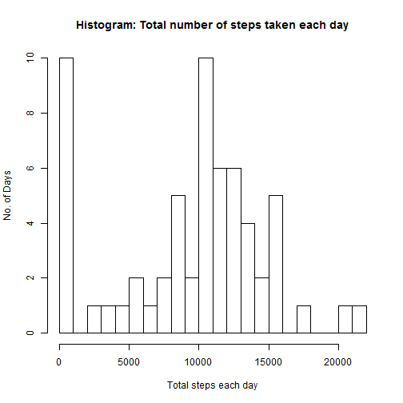
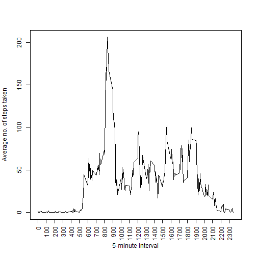
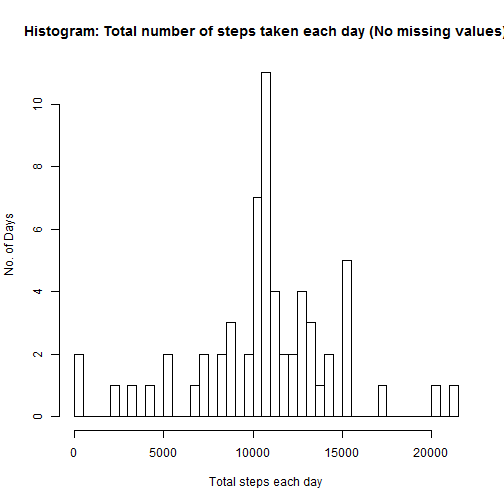
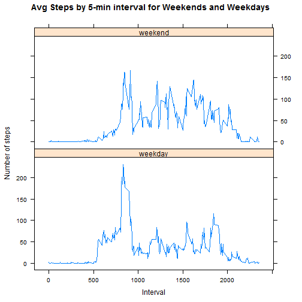

###Checking for the Data File (.csv) and the Source File (.zip)
The following code checks the 'working directory', first for the csv file and then for the zip file. If csv file is present, we have what we need for analysis, and we move forward. If not, we check for presence of zip file and then download it and/or unzip it to get the csv file. "Echo" by default is *TRUE* everywhere so that all the code is visible. 


```r
a <- dir()
if(("activity.csv" %in% a) == FALSE){
    if(("repdata-data-activity.zip" %in% a) == FALSE){
     print("zip file is absent. Downloading and extracting the zip file.")
     url1 <- "https://d396qusza40orc.cloudfront.net/repdata%2Fdata%2Factivity.zip"
     download.file(url1, "repdata-data-activity.zip")
     print("Download and extraction complete.")
     unzip("repdata-data-activity.zip")
   } else{
     print("Data file is absent but zip file is present. Data file extracted.")
     unzip("repdata-data-activity.zip")
   }
} else{
  "Data file is present. Moving ahead with the calculations."
}
```


###Loading the Data File (.csv) in R Environment


```r
data <- read.csv(file = "activity.csv", header = TRUE)
```


###What is mean total number of steps taken per day?

####1. Calculate the total number of steps taken per day
As per assignment rules, we can ignore the missing values in the dataset for this part of the assignment. Hence, I have used "na.rm = TRUE".


```r
stepsT <- tapply(data$steps, data$date, FUN = sum, na.rm = TRUE)
```

####2. Make a histogram of the total number of steps taken each day
I have used "breaks = 20" for better graphical representation.


```r
hist(stepsT, breaks = 20, xlab = "Total steps each day", ylab = "No. of Days", main = "Histogram: Total number of steps taken each day")
```

 

####3. Calculate and report the mean and median of the total number of steps taken per day


```r
mean(stepsT)
```

```
## [1] 9354.23
```
Mean of the total number of steps taken per day is **9354.2295082**.


```r
median(stepsT)
```

```
## [1] 10395
```
Median of the total number of steps taken per day is **10395**.


###What is the average daily activity pattern?

####1. Make a time series plot of the 5-minute interval (x-axis) and the average number of steps taken, averaged across all days (y-axis)
First step is to calculate the average number of steps for each 5-minute interval, averaged across all days (y-axis). We will also assign new names to replace the default column names.


```r
AvgSteps <- aggregate(x = data$steps, by = list(data$interval), FUN = mean, na.rm = TRUE)

#Changing column names
names(AvgSteps)[1] <- "interval"
names(AvgSteps)[2] <- "avgsteps"
```

Now, we create the required plot.


```r
plot(x = AvgSteps$interval, y = AvgSteps$avgsteps, type = "l", xlab = "5-minute interval", ylab = "Average no. of steps taken", xaxt = "n")
axis(1, at = seq(0, 2300, by = 100), las = 2)
```

 

####2. Which 5-minute interval, on average across all the days in the dataset, contains the maximum number of steps?


```r
AvgSteps[which.max(AvgSteps$avgsteps), ]
```

```
##     interval avgsteps
## 104      835 206.1698
```

So, **835**th interval contains the maximum number of steps (**206.1698113**).


###Imputing Missing Values

####1. Calculate and report the total number of missing values in the dataset (i.e. the total number of rows with NAs)

By summarizing the data we can see which columns have NA values.


```r
summary(data)
```

```
##      steps                date          interval     
##  Min.   :  0.00   2012-10-01:  288   Min.   :   0.0  
##  1st Qu.:  0.00   2012-10-02:  288   1st Qu.: 588.8  
##  Median :  0.00   2012-10-03:  288   Median :1177.5  
##  Mean   : 37.38   2012-10-04:  288   Mean   :1177.5  
##  3rd Qu.: 12.00   2012-10-05:  288   3rd Qu.:1766.2  
##  Max.   :806.00   2012-10-06:  288   Max.   :2355.0  
##  NA's   :2304     (Other)   :15840
```

As can be seen, only *'steps'* column has NA values and we can also see the number of NAs. Thus, there are **2304** missing values in the dataset.

####2. Devise a strategy for filling in all of the missing values in the dataset.

First, we will assign the existing dataset to a new variable so as to preserve the earlier set and go back to it at any point, if required. Then, we will perform the calculations to replace missing values (NAs) with mean number of steps for corresponding 5-minute interval from the AvgSteps dataset calculated above.

####3. Create a new dataset that is equal to the original dataset but with the missing data filled in.

I am creating a dataset 'data1' which will be equal to the original dataset but with the missing data filled in as per the strategy devised earlier.


```r
data1 <- data

l <- length(data$steps)

for(i in 1:l){
    if(is.na(data1$steps[i])){
        data1$steps[i] <- AvgSteps$avgsteps[data1$interval[i]==AvgSteps$interval]
    }
}
```

Now, let us check a sample of original dataset 'data' and new dataset 'data1' to see if the missing values have been filled in the new one.


```r
head(data)
```

```
##   steps       date interval
## 1    NA 2012-10-01        0
## 2    NA 2012-10-01        5
## 3    NA 2012-10-01       10
## 4    NA 2012-10-01       15
## 5    NA 2012-10-01       20
## 6    NA 2012-10-01       25
```

```r
head(data1)
```

```
##       steps       date interval
## 1 1.7169811 2012-10-01        0
## 2 0.3396226 2012-10-01        5
## 3 0.1320755 2012-10-01       10
## 4 0.1509434 2012-10-01       15
## 5 0.0754717 2012-10-01       20
## 6 2.0943396 2012-10-01       25
```

As can be seen, the missing values (NAs) have been replaced. To check if the missing values have been replaced with the corresponding interval mean number of steps from AvgSteps dataset, we can use *head(AvgSteps)* for a quick visual inspection.


####4. Make a histogram of the total number of steps taken each day and Calculate and report the mean and median total number of steps taken per day. Do these values differ from the estimates from the first part of the assignment? What is the impact of imputing missing data on the estimates of the total daily number of steps?

First, we make a histogram using new dataset *data1*.


```r
histdata1 <- tapply(data1$steps, data1$date, FUN = sum)
hist(histdata1, breaks = 50, , xlab = "Total steps each day", ylab = "No. of Days", main = "Histogram: Total number of steps taken each day (No missing values)")
```

 


Now, we will calculate the new mean and median values.

```r
mean(histdata1)
```

```
## [1] 10766.19
```

Clearly, new mean of the total number of steps taken per day is greater than the previous mean 9354.2295082.


```r
median(histdata1)
```

```
## [1] 10766.19
```
Clearly, new median of the total number of steps taken per day is greater than the previous median 10395.

**Impact of Imputing** - as we can see due to imputing missing data the mean and median of the new dataset *data1* has increased.


###Are there differences in activity patterns between weekdays and weekends?
As per the instructions, using the dataset *data1* which has filled-in missing values.
 
####1. Create a new factor variable in the dataset with two levels - "weekday" and "weekend" indicating whether a given date is a weekday or weekend day.

First, we need to identify each of the days corresponding to the dates in the dataset *data1* and store it in a variable *Day*. 


```r
Day <- weekdays(as.Date(data1$date))
```

Then, we introduce *Day* and a new column **wday** in the dataset *'data1'* and create a new dataset *data2* so as to keep the earlier dataset intact, to go back to it if required.


```r
wday <- 0
data2 <- cbind(data1, Day, wday)
```

Now, we fill the rows of the column *wday* in the dataset *data2* with 'weekday' or 'weekend', and convert the entire column to factors.


```r
l1 <- length(data2$Day)

for(i in 1:l1){
    if(data2$Day[i] == "Saturday"){
        data2$wday[i] <- "weekend"
    } else if(data2$Day[i] == "Sunday"){
        data2$wday[i] <- "weekend"
    } else{
        data2$wday[i] <- "weekday"
    }
}

data2$wday <- as.factor(data2$wday)
```

Thus, now we have a dataset *data2* with a new factor variable *wday* with two levels - "weekday" and "weekend" indicating whether a given date is a weekday or weekend day.

####2. Make a panel plot containing a time series plot of the 5-minute interval (x-axis) and the average number of steps taken, averaged across all weekday days or weekend days (y-axis).

First step is to calculate the average number of steps for each 5-minute interval, averaged across all days (y-axis). We will also assign new names to replace the default column names.


```r
AvgStepsNew <- aggregate(steps ~ interval + wday, data = data2, mean)
```

Now, we create the required plot.


```r
library(lattice)
xyplot(steps ~ interval|wday, AvgStepsNew, layout = c(1,2), , type = "l", ylab = "Number of steps", xlab = "Interval", main = "Avg Steps by 5-min interval for Weekends and Weekdays")
```

 
